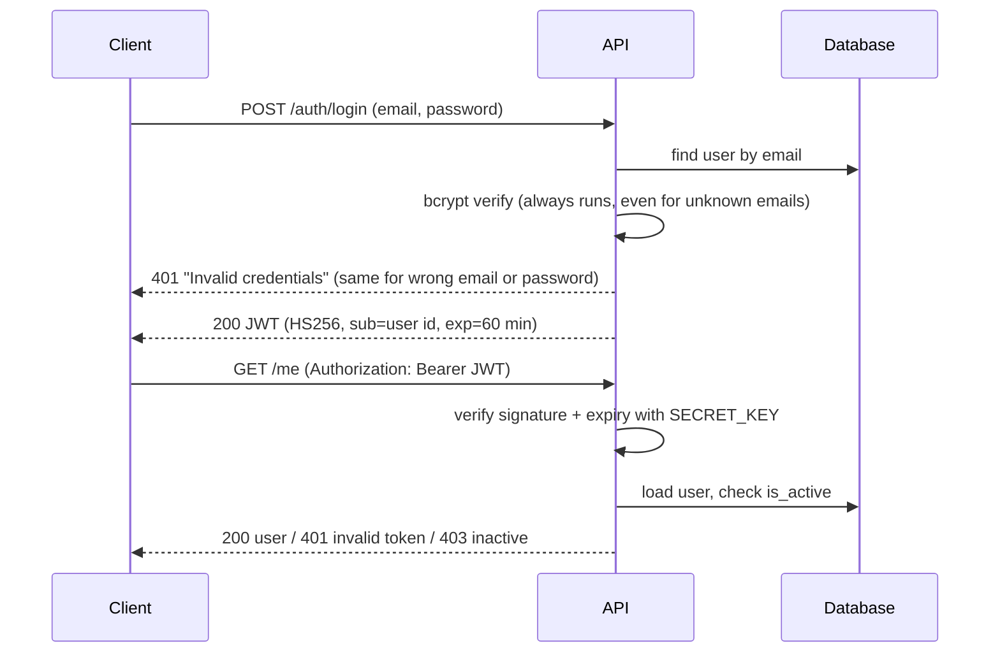

# FastAPI Auth Backend

A REST API for user registration and login with JWT access tokens, bcrypt password hashing and role-based access (user/admin). Built with FastAPI and SQLAlchemy; SQLite locally, PostgreSQL in deployment (Render).

## Endpoints

| Method | Path | Auth | Description |
|---|---|---|---|
| `GET` | `/` | – | Service info |
| `GET` | `/health/` | – | Health check |
| `POST` | `/users/` | – | Register: `{"email": ..., "password": ...}` (8–72 bytes) |
| `POST` | `/auth/login` | – | Login (form fields `username` = email, `password`) → `{"access_token", "token_type": "bearer"}`. Rate limited |
| `GET` | `/users/me` | Bearer token | Current user |
| `GET` | `/users/dashboard` | Bearer token | Current user summary |
| `GET` | `/users/` | Bearer token, **admin** | List all users |

Interactive docs: `http://localhost:8000/docs`.

The first version used `POST /`, `GET /me` and `GET /dashboard`. They still work for existing clients but are marked **deprecated** in the docs. The old version also had the admin user list on `GET /`, the same path as the root endpoint, so one of them was unreachable. That is fixed by moving user routes under `/users/`.

## How authentication works



## Local setup

```bash
python -m venv .venv && source .venv/bin/activate
pip install -r requirements-dev.txt
cp .env.example .env
# put a real key into .env:
python -c "import secrets; print(secrets.token_urlsafe(48))"
uvicorn app.main:app --reload
```

### Configuration (environment variables)

| Variable | Required | Default | Notes |
|---|---|---|---|
| `SECRET_KEY` | **yes** | – | JWT signing key, at least 32 characters. The app refuses to start without it. |
| `DATABASE_URL` | no | `sqlite:///./local.db` | `postgres://` URLs are converted to `postgresql://` automatically |
| `ACCESS_TOKEN_EXPIRE_MINUTES` | no | `60` | |
| `FIRST_ADMIN_EMAIL` / `FIRST_ADMIN_PASSWORD` | no | – | Creates the first admin on startup **only if that email does not exist yet** |
| `LOGIN_MAX_ATTEMPTS_PER_EMAIL` | no | `5` | Failed logins per email before `429` |
| `LOGIN_MAX_ATTEMPTS_PER_IP` | no | `20` | Failed logins per client IP before `429` |
| `LOGIN_WINDOW_SECONDS` | no | `300` | Time window for the limits above |

On Render, set these in the service's **Environment** settings. Never commit `.env` (it is git-ignored).

## Tests

```bash
pytest -q
```

29 tests cover:
- registration: hashing, duplicate and case-insensitive email, password length and the 72-byte bcrypt limit
- login: success, wrong password and unknown user return the same error, inactive users
- tokens: expired, forged with another key, malformed `sub`
- admin-only access
- login rate limiting (per email and per IP; success resets the email counter)
- route layout: no duplicate operations, deprecated paths still work
- compatibility with password hashes created by the earlier passlib version
- configuration failures
- admin bootstrap

The tests also run in GitHub Actions on every push and pull request.

## Security notes

- **Secrets:** no secrets in the code. A JWT signing key was hardcoded in an earlier version of this public repository. It is no longer used, and a new `SECRET_KEY` must be set in every environment.
- **Passwords:** bcrypt (cost 12), never stored or returned in plain text.
- **Brute force:** after 5 failed logins for an email (or 20 from one IP) within 5 minutes, login returns `429` with `Retry-After`. While blocked, even the correct password is refused.
- **No user enumeration:** login gives the same response and similar timing for unknown emails and wrong passwords.
- **Tokens:** HS256 only (the algorithm cannot be chosen by the token), 60-minute expiry, inactive users are rejected even with a valid token.
- **Admin bootstrap:** never promotes an existing account (registration is public, so someone could register the admin email first).

## Limitations and next steps

- The rate limiter keeps its counters in memory: they reset on restart and are not shared across instances. With more than one instance, a shared store (e.g. Redis) is needed.
- No refresh tokens or token revocation; tokens are valid until they expire (60 min).
- Tables are created with `create_all`. Schema changes would need migrations (Alembic). The one-off script used to add `is_admin` is kept in `scripts/`.
- `python-jose` works but is less actively maintained than `PyJWT`; switching is a possible next step.
