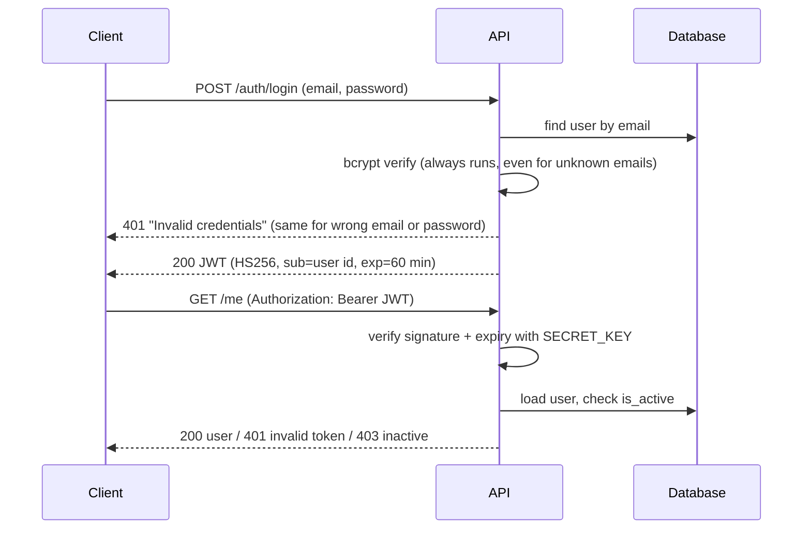

# FastAPI Auth Backend

A REST API for user registration and login with JWT access tokens, bcrypt password hashing and role-based access (user/admin). Built with FastAPI and SQLAlchemy; SQLite locally, PostgreSQL in deployment (Render).

## Endpoints

| Method | Path | Auth | Description |
|---|---|---|---|
| `GET` | `/health/` | – | Health check |
| `POST` | `/` | – | Register: `{"email": ..., "password": ...}` (8–72 bytes) |
| `POST` | `/auth/login` | – | Login (form fields `username` = email, `password`) → `{"access_token", "token_type": "bearer"}` |
| `GET` | `/me` | Bearer token | Current user |
| `GET` | `/dashboard` | Bearer token | Current user summary |
| `GET` | `/` | Bearer token, **admin** | List all users |

Interactive docs: `http://localhost:8000/docs`.

## How authentication works



## Local setup

```bash
python -m venv .venv && source .venv/bin/activate
pip install -r requirements-dev.txt
cp .env.example .env
# put a real key into .env:
python -c "import secrets; print(secrets.token_urlsafe(48))"
uvicorn app.main:app --reload
```

### Configuration (environment variables)

| Variable | Required | Default | Notes |
|---|---|---|---|
| `SECRET_KEY` | **yes** | – | JWT signing key, at least 32 characters. The app refuses to start without it. |
| `DATABASE_URL` | no | `sqlite:///./local.db` | `postgres://` URLs are converted to `postgresql://` automatically |
| `ACCESS_TOKEN_EXPIRE_MINUTES` | no | `60` | |
| `FIRST_ADMIN_EMAIL` / `FIRST_ADMIN_PASSWORD` | no | – | Creates the first admin on startup **only if that email does not exist yet** |

On Render, set these in the service's **Environment** settings. Never commit `.env` (it is git-ignored).

## Tests

```bash
pytest -q
```

20 tests cover:
- registration: hashing, duplicate and case-insensitive email, password length and the 72-byte bcrypt limit
- login: success, wrong password and unknown user return the same error, inactive users
- tokens: expired, forged with another key, malformed `sub`
- admin-only access
- configuration failures
- admin bootstrap

The tests also run in GitHub Actions on every push and pull request.

## Security notes

- **Secrets:** no secrets in the code. A JWT signing key was hardcoded in an earlier version of this public repository. It is no longer used, and a new `SECRET_KEY` must be set in every environment.
- **Passwords:** bcrypt via passlib, never stored or returned in plain text.
- **No user enumeration:** login gives the same response and similar timing for unknown emails and wrong passwords.
- **Tokens:** HS256 only (the algorithm cannot be chosen by the token), 60-minute expiry, inactive users are rejected even with a valid token.
- **Admin bootstrap:** never promotes an existing account (registration is public, so someone could register the admin email first).

## Limitations and next steps

- No rate limiting or account lockout on `/auth/login` yet (e.g. `slowapi` or a reverse proxy limit).
- No refresh tokens or token revocation; tokens are valid until they expire.
- Tables are created with `create_all`; schema changes would need migrations (Alembic).
- `passlib` is no longer actively maintained; switching to the `bcrypt` library directly (or `pwdlib`) is a planned change.
- Registration lives at `POST /` (kept for compatibility); a `/users` prefix would be cleaner.
